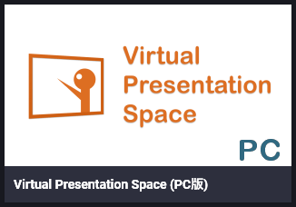
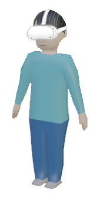

# **VRトークについて**

### **やったことの概略 やってみての所感**

<!-------------------------------->

## **反省点**

### 不安になって喋りすぎた

- 不安になった理由は後ほど。

### 予定より長くなった

<!-------------------------------->

## とはいえ

### もくもく会は練習の場でもあります。

### ここで失敗しておきましょう。

- 聴いてる方も承知してます (多分)。

<!-------------------------------->

## 使ったアプリ

### **Virtual Presentation Space**

- VR でプレゼンして録画できる。
- PC 版と Quest 版がある。

<!-------------------------------->

### Quest2 + Link で PC 版を使える

- PC にミラーリングできる。

<!-------------------------------->

## **スライド (PDF) を用意する**

Virtual Presentation Space で使えるスライド

- PDF
- Web (実験的機能)

<!-------------------------------->

## **Markdown で書きたい**

### Markdown → PDF の変換に、以前は

 を使っていた。

### → 2020年12月に終了。

<!-------------------------------->

## **Markdown PDF**

今はこれを使ってます。

- VSCode の拡張機能。
- html タグで改ページしてスライドに。

<!-------------------------------->

<!-------------------------------->

## **アバター**

アプリにプリセットのアバターや、  
Web で手に入るアバターもあります。

 

### **結局、自分で作ることに。**

<!-------------------------------->

## **アバターを VRM で作る**

**VRM** は、アバターの共通フォーマット。  
2018年にドワンゴが発表。

### **Virtual Presentation Space** も **VRM** に対応。

<!-------------------------------->

 でモデル (FBX) を作る。

※無料の高機能モデリングツール

<!-------------------------------->

 で VRM に変換する。

※無料のパーソナル版

<!-------------------------------->

## **Zoom でトークするには**

### アプリのウィンドウを共有するだけ。

- 録画用の映像がミラーリングされる。

オーディオ設定

- VR ゴーグルのマイク
- VR ゴーグルのヘッドホン

<!-------------------------------->

## **トラブル (1)**

### VR 空間が斜めになって、焦った

<!-------------------------------->

## **トラブル (2)**

### デスクトップが見れなくて、焦った

<!-------------------------------->

## **システム構成が複雑**

- Oculus Quest2 (Android)
    - Oculus Link
- Oculus for PC (Windows)
    - Steam VR
        - Vive アプリ

誰のせいでボタンが効かなくなったのか…。

<!-------------------------------->

## **思ったより孤独を感じた**

 

(不安になった理由)

<!-------------------------------->

### おすすめしませんが、質問は歓迎します。

こことかで。

<!-------------------------------->

 
 

## ご清聴ありがとうございました。
