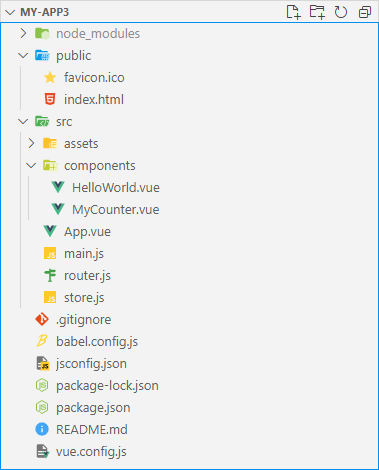
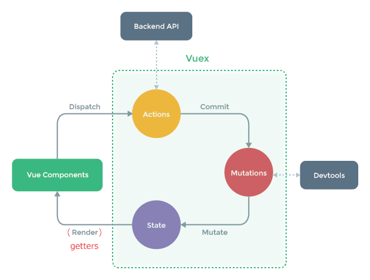

# **Vue.js 超入門 (概念的理解)**

## 発表の経緯

現場で Vue.js を使っているのですが、  
大きなプロジェクトの細かいところばかり見ている。

- 基本的な概念
- 全体がどうつながっているか

といったことをちゃんと理解したいと思った。

<div style="page-break-before:always"></div><!-------------------------------->

## <u>前提知識</u>

- JavaScript
- Node.js
    - JavaScript の実行環境であるということ
- npm
    - Node.js のパッケージ管理ツールであるということ

<div style="page-break-before:always"></div><!-------------------------------->

## <u>概要</u>

1. Vue.js とは何か
    - 現場でよく見る構成
1. Vue CLI とは何か
    - 全体のつながりを把握しよう
1. 定番ライブラリ
    - vue-router
    - vuex-store

<div style="page-break-before:always"></div><!-------------------------------->

## <u>Vue.js とは何か</u>

- JavaScript のライブラリ
    - Vue オブジェクトを提供する。
- リアクティブ
    - Vue が画面要素とデータやメソッドを結びつける。
- プログレッシブ
    - 必要な機能だけ使えば良い。
    - フレームワークにもなる。

&nbsp;

<div style="page-break-before:always"></div><!-------------------------------->

## <u>もっとも簡単な使い方</u>

```html
<script src="https://unpkg.com/vue@3.2.31"></script>
<div id="app">{{ msg }}</div>
<script>
  Vue.createApp({
    data() {return {msg: 'Hello, World.'}}
  }).mount('#app')
</script>
```

ライブラリを読み込んで Vue オブジェクトを作るだけの HTML。
- ここにメソッドとか追加して作り込める。
- UI -> data 方向のバインディングも可能。

<div style="page-break-before:always"></div><!-------------------------------->

## <u>現場でよく見る構成</u>

<table><tr>
<td width="50%"></td>
<td>
プロジェクトをひな形から作成している。<br>
<br>
html ではなく vue ファイルを書くようになる。<br>
<br>
router や store といった定番ライブラリもインストールしている。<br>
<br>
実際はもっとフォルダ分けすると思います。
</td>
</tr></table>


<div style="page-break-before:always"></div><!-------------------------------->

## <u>プロジェクトをひな形から作成</u>

### 例1 (主に Vue.js 2.x の場合)

```
> vue init webpack my-app
```

### 例2 (主に Vue.js 3.x の場合)

```
> vue create my-app3
```

- この "vue" は Vue.js ではなく vue-cli のコマンド。

<div style="page-break-before:always"></div><!-------------------------------->

## <u>Vue CLI とは何か</u>

Vue CLI は、Vue.js での開発を補助するツール

- npm でインストール。
- コマンドは `vue`。

できること
- ひな形からプロジェクト作成
- vue ファイル/プロジェクトのビルド
- 開発用サーバの起動
- テストの実行
- etc.

<div style="page-break-before:always"></div><!-------------------------------->

## <u>ビルドは何をするか</u>

以下のような vue ファイルを Web ブラウザで実行できる形にする。

```html
<template>
  <div><p>{{ msg }}</p></div>
</template>

<script>
export default {
  name: 'HelloWorld',
  data() {return {msg: 'Hello, World.'}}
}
</script>
...
```

<div style="page-break-before:always"></div><!-------------------------------->

## <u>プロジェクトのビルド</u>

|ファイル|役割 (例)|
|-|-|
|public/index.html|main.js が組み込まれエントリポイントとなる。|
|src/main.js|App.vue をマウントする JS になる。|
|src/App.vue|router からの vue コンポーネントの受け皿。|
|src/router.js|パスや条件に応じて表示するコンポーネントを決める。|
|src/components/xx.vue|vue コンポーネント。|
---

※ import/export によりこれらが連動する。

<div style="page-break-before:always"></div><!-------------------------------->

## <u>全体のつながりを把握しよう</u>

1. 基本は import/export を追いかける。
1. コンポーネントの親子関係を知る。
    - データの受け渡しがどうなっているか等。
1. `$router`, `$store` といった約束事を覚える。
    - `router` を持つコンポーネントやその子孫は `this.$router` で `router` にアクセスできる。

<div style="page-break-before:always"></div><!-------------------------------->

## <u>その他、ビルドにより起こること</u>

- 難読化
- Babel の実行
    - ES2015 の構文を古い構文に変換
- Scoped style の解決
- etc.

<div style="page-break-before:always"></div><!-------------------------------->

## <u>定番ライブラリ</u>

- vue-router
    - 画面遷移をコントロール (SPA を構築) する
- vuex-store
    - 状態 (変数とか) 管理のためのデータフロー

main.js でマウントする vue に適用すれば、各コンポーネントから使えます。

```JavaScript
const app = createApp(App)
app.use(router)
app.use(store)
app.mount('#app')
```

<div style="page-break-before:always"></div><!-------------------------------->

## <u>vue-router</u>

### router.js (かなり省略してます)

```JavaScript
import { createRouter } from 'vue-router'
import HelloWorld from '@/components/HelloWorld'

export default createRouter({
  routes: [
    { path: '/',
      name: 'HelloWorld',
      component: HelloWorld },
    ...
  ]
})
```

<div style="page-break-before:always"></div><!-------------------------------->

## <u>vuex-store</u>

### store.js (かなり省略してます)

```JavaScript
import { createStore } from 'vuex'

export default createStore({
  state: {count: 0},
  getters: {
      count (state) {return state.count}},
  mutations: {
      increment (state) {state.count++}},
  actions: {
      increment (context) {context.commit('increment')}}
})
```

<div style="page-break-before:always"></div><!-------------------------------->

## <u>vuex-store によるデータフロー</u>

「Vuex とは何か？」 (https://vuex.vuejs.org/ja/) より



<div style="page-break-before:always"></div><!-------------------------------->

## <u>まとめ</u>

- 現場の手垢にまみれたコードを知りすぎる前に、  
自分で一から作ったきれいなプロジェクトを見ておきましょう。

- ある機能を実装する方法はたくさんあります。  
テクニックに走る前に、ツールのコンセプトを理解しましょう。
